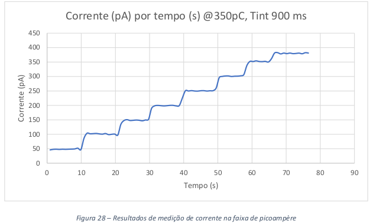

# pico-electrometer

C++ firmware for data retrieving of my graduation final project - a low-current ammeter which can measure currents from pico to micro amperes.

More information in [my end course report (PDF)](./Documentation/EA006_GuilhermeSemissatto_1s2017.pdf). This file can show the way I write technical documents.

